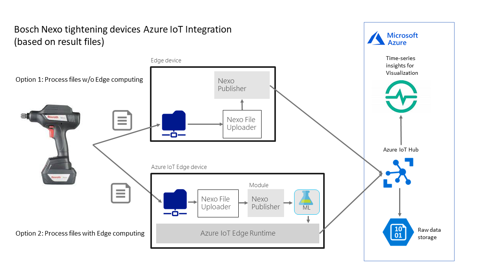
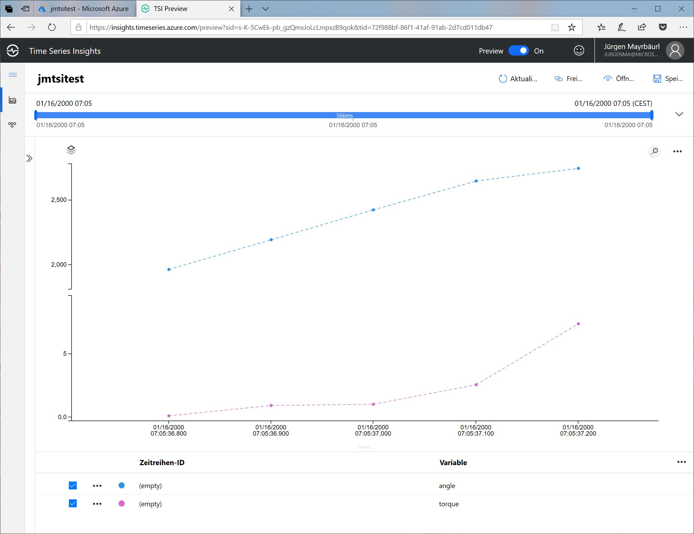

# Sample Bosch Nexo Tightening device integration with Azure IoT

This sample shows how to integrate [Bosch Rexroth Nexo Tightening devices](https://www.boschrexroth.com/en/us/products/product-groups/tightening-technology/topics/nexo-cordless-wi-fi-nutrunner/index) with Azure IoT services (mainly [Azure IoT Hub](https://azure.microsoft.com/en-us/services/iot-hub/) and [Azure IoT Edge](https://azure.microsoft.com/en-us/services/iot-edge/)). Using the component Nexo Publisher process information from the tightening devices can be sent to the Cloud based Azure IoT Hub for further analysis or moved to local Edge processing on Azure IoT Edge.

As already mentioned before Bosch's tightening devices can store their process information, containing timestamped angle and torque values, in json files, that contain the full information about the complete tightening process. Some samples are stored in [processSamples](processSamples) folder in this repo. 

1. **Option 1 - Process files w/o Edge computing:** Process files, stored locally on an edge device, get published directly to Azure IoT Hub by using the Nexo Publisher, optinally using the cli tool Nexo File Uploader.
2. **Option 2 -  Process files with Edge computing:** Process files, stored locally on an edge device, are ingested into the Azure IoT Edge data processing pipeline and can optionally be processed by other edge modules, e.g. Azure Machine Learning based modules with anomoly detection.



## Nexo Publisher

The Nexo Publisher is the central component to ingest process data from the tightening devices to Azure IoT Hub or Azure IoT Edge. It's implemented as a REST service with Spring Boot and can be run from the command line, as Docker container or Azure IoT Edge module. Nexo Publisher supports Swagger and the REST API documentation, aka Swagger UI, is e.g. available at http://localhost:8080/swagger-ui.html

1. Publishing a process file: ***http://localhost:8080/publish***: Assumes that the process file is sent in the request body as json string and sends it as one message to Azure IoT Hub or Azure IoT Edge (output1)
2. Streaming graph entries of a process file: ***http://localhost:8080/stream***: As with the publish function the process file should be sent in the request body as json string. All graph entries of all tightening steps are streamed as single messages to IoT Hub or Azure IoT Edge. The used payload message format is documented below.
3. (Experimental) Simple forwarding of any json data: ***http://localhost:8080/forward***: The json string in the request body is simply forwarded to Azure IoT Hub or Azure IoT Edge.

### Azure IoT Hub message formats

All messages send by the Nexo Publisher have their properties set in the following way:
- Property `source`: Always set to 'nexopublisher'
- Property `messagetype`: Set to 'process' for 'publish', 'events' for 'stream' and 'any' for 'forward'
- Property `channel` and `result` are only used for 'publish' and 'stream'

The message format used for streaming graph entries looks like:
```json
{
    "idcode": "L000147953",
    "cycle": 147953,
    "steprow": "2",
    "stepcol": "A",
    "stepIndex": 1,
    "graphIndex": 1,
    "timestamp": "2000-01-16T06:05:36.709",
    "angle": 1631,
    "torque": 0.069
}
```

### Configuration
1. Server port: Defaults to 8080 and can be configured with the `--server.port` command line argument. For more details see the [Spring Boot documentation](https://docs.spring.io/spring-boot/docs/current/reference/html/howto-properties-and-configuration.html#howto-use-short-command-line-arguments)
2. IoT Hub connectivity: The Azure IoT Hub connection string and protocol can be configured with the Spring Boot properties `nexopublisher.connectionString` and `nexopublisher.protocol`, e.g. as environment variables. In the case of running Nexo Publisher as Azure IoT Edge module the IoT Hub connection string is retrieved from the environment and isn't needed.

### Running Nexo Publisher from the Command line
TODO
### Running Nexo Publisher as Docker container
TODO
### Running Nexo Publisher as Azure IoT Edge module
TODO

## Nexo File uploader
TODO


## Sample visualization of the tightening process curve in [Azure Time Series Insights](https://azure.microsoft.com/en-us/services/time-series-insights/)

