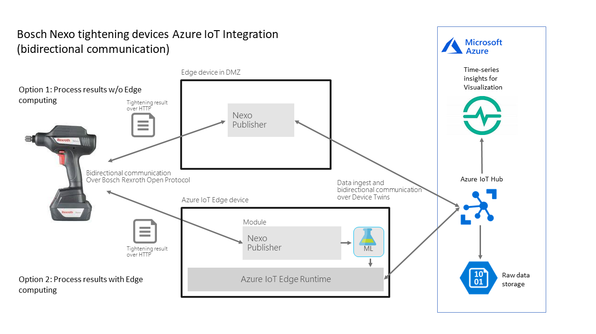
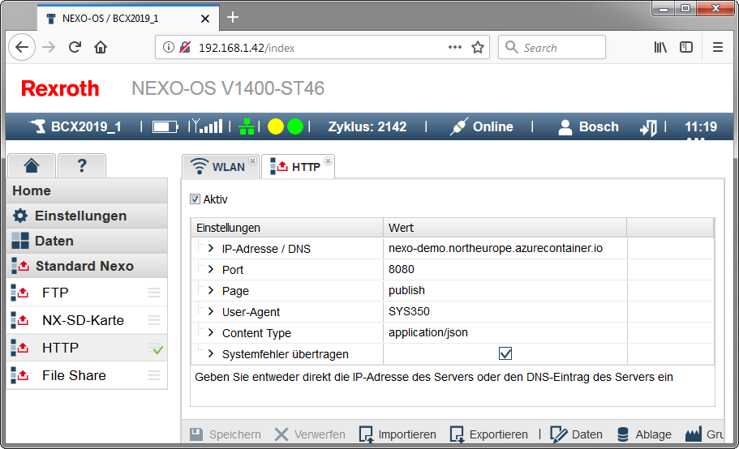
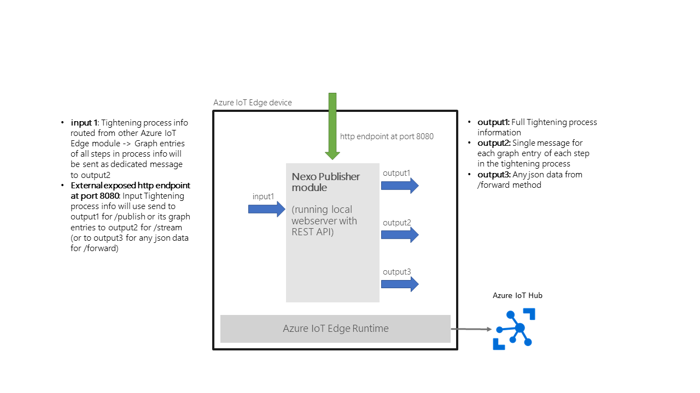

# Sample Bosch Nexo Tightening device integration with Azure IoT

This sample shows how to integrate [Bosch Rexroth Nexo Tightening devices](https://www.boschrexroth.com/en/us/products/product-groups/tightening-technology/topics/nexo-cordless-wi-fi-nutrunner/index) with Azure IoT services (mainly [Azure IoT Hub](https://azure.microsoft.com/en-us/services/iot-hub/) and [Azure IoT Edge](https://azure.microsoft.com/en-us/services/iot-edge/)). Using the component Nexo Publisher process information from the tightening devices can be sent to the Cloud based Azure IoT Hub for further analysis or moved to local Edge processing on Azure IoT Edge.

## Processing tightening results using Nexo's HTTP data service

The Nexo device operating system offers several data services that are capable of sending tightening process results to different external service endpoints, like FTP and HTTP.

1. **Option 1 - Process results w/o Edge computing:** Process tightening results sent directly from the Nexo device to the REST endpoint of the Nexo publisher component.
2. **Option 2 -  Process results with Edge computing:** Process tightening results are ingested into the Azure IoT Edge data processing pipeline and can optionally be processed by other edge modules, e.g. Azure Machine Learning based modules with anomoly detection.



## Processing tightening result files

As already mentioned before Bosch's tightening devices can store their process information, containing timestamped angle and torque values, in json files, that contain the full information about the complete tightening process. Some samples are stored in [processSamples](processSamples) folder in this repo.

1. **Option 1 - Process files w/o Edge computing:** Process files, stored locally on an edge device, get published directly to Azure IoT Hub by using the Nexo Publisher, optionally using the cli tool Nexo File Uploader.
2. **Option 2 -  Process files with Edge computing:** Process files, stored locally on an edge device, are ingested into the Azure IoT Edge data processing pipeline and can optionally be processed by other edge modules, e.g. Azure Machine Learning based modules with anomoly detection.


## Nexo Publisher

The Nexo Publisher is the central component to ingest process data from the tightening devices to Azure IoT Hub or Azure IoT Edge. It's implemented as a REST service with Spring Boot and can be run from the command line, as Docker container or Azure IoT Edge module. Nexo Publisher supports Swagger and the REST API documentation, aka Swagger UI, is e.g. available at <http://localhost:8080/swagger-ui.html>

1. Publishing a process file: ***http://localhost:8080/publish***: Assumes that the process file is sent in the request body as json string and sends it as one message to Azure IoT Hub or Azure IoT Edge (output1)
2. Streaming graph entries of a process file: ***http://localhost:8080/stream***: As with the publish function the process file should be sent in the request body as json string. All graph entries of all tightening steps are streamed as single messages to IoT Hub or Azure IoT Edge. The used payload message format is documented below.
3. (Experimental) Simple forwarding of any json data: ***http://localhost:8080/forward***: The json string in the request body is simply forwarded to Azure IoT Hub or Azure IoT Edge.

### Azure IoT Hub message formats

All messages send by the Nexo Publisher have their properties set in the following way:

- Property `source`: Always set to 'nexopublisher'
- Property `messagetype`: Set to 'process' for 'publish', 'events' for 'stream' and 'any' for 'forward'
- Property `channel` and `result` are only used for 'publish' and 'stream'

The message format used for streaming graph entries looks like:

```json
{
    "idcode": "L000147953",
    "cycle": 147953,
    "steprow": "2",
    "stepcol": "A",
    "stepIndex": 1,
    "graphIndex": 1,
    "timestamp": "2000-01-16T06:05:36.709",
    "angle": 1631,
    "torque": 0.069
}
```

### Configuration - Location of configuration files

Nexo Publisher is a Spring Boot application and therefore can use all configuration possibilites that are available for this kind of applications. See the Spring Boot application for further information.

Certain capabilities of the Nexo Publisher, e.g. the usage of the Azure Device Provisioning Service, need additional configurations, that are stored in json configuration files. The location of these configurations files defaults to the folder 'nexo' in the [user's home directory](https://docs.oracle.com/javase/tutorial/essential/environment/sysprop.html). But the location of the configuration directory can be changed by using the Spring Boot property `nexopublisher_config_dirpath`, e.g. as environment variables.

### Configuration - Azure IoT Hub connectivity

Configuring the connectivity to Azure IoT Hub is only necessary, if the Nexo Publisher is not run as an Azure IoT Edge module. In the case of running Nexo Publisher as Azure IoT Edge module the IoT Hub connection string is retrieved from the environment.

There are two ways to configure the connection to IoT Hub. In both cases the transport protocol to be used to communicate with Azure IoT Hub has to be specified in the Spring Boot property `nexopublisher_protocol`, e.g. as environment variables. It defaults to MQTT.

A) Using an [Azure IoT Hub connection string from the device registration](https://docs.microsoft.com/en-us/azure/iot-hub/iot-hub-devguide-identity-registry):The Azure IoT Hub connection string can be configured with the Spring Boot property `nexopublisher_connectionString`, e.g. as environment variables.

B) Using the [Azure Device Provisioning Service](https://docs.microsoft.com/en-us/azure/iot-dps/): To be able to use the Azure Device Provisioning Service the Spring Boot property `nexopublisher_dps_enabled` has to be set to true, e.g. as environment variables. It defaults to false. Currently only the usage of [Symmetric keys](https://docs.microsoft.com/en-us/azure/iot-dps/concepts-symmetric-key-attestation) for Provisioning is supported. The following provisioning configuration file, a json file stored in the Nexo configuration directory and named 'nexoIoTHubConfiguration.json', is used. Other file names are supported by using the Spring Boot property `nexopublisher_config_provConfigFilename`. A sample of this configuration file is available in the [assets folder](./assets/nexoIoTHubConfiguration_sample.json).

```json
{
  "scopeId" : "[Put in the Scope ID individual enrollment in Azure DPS]",
  "dpsGlobalEndpoint" : "global.azure-devices-provisioning.net",
  "registrationId" : "[Put in the Registration ID for the device from the individual enrollment in Azure DPS]",
  "symmetricKey" : "[Put in the Symmetric key from the individual enrollment in Azure DPS]"
}
```

### Configuration - Nexo device to Nexo Publisher

1. Server port: Defaults to 8080 and can be configured with the `--server.port` command line argument. For more details see the [Spring Boot documentation](https://docs.spring.io/spring-boot/docs/current/reference/html/howto-properties-and-configuration.html#howto-use-short-command-line-arguments)
2. Nexo tightening device configuration: E.g. using HTTP to post all process info to Nexo Publisher running in the cloud 
3. Alternatively use 'File Share' and the Nexo file uploader component

### Configuration - Nexo Publisher to Nexo device

To get other information from the Nexo device and to control the Nexo device, Nexo Publisher is connected to the Nexo device over TCP/IP using the Bosch Rexroth Open Protocol (for details see the Nexo device documentation).Two configuration parameters are used to establish the connection to the Nexo device. These parameters can be set by using the following environement variables:

**nexopublisher_nexoip**: IP address or URL of the Nexo device

**nexopublisher_nexoport**: Port the Nexo device is configured to use for the Bosch Rexroth Open Protocol

### Running Nexo Publisher from the Command line

E.g. by using MQTT as transport protocol to the Azure IoT Hub:

```bsh
java -D"nexopublisher_protocol"=MQTT -D"nexopublisher_connectionString"="[Insert your IoT Hub connection string for the device here]" -jar .\nexopublisher-1.0.0.jar
```

### Running Nexo Publisher as Docker container

E.g. by using MQTT as transport protocol to the Azure IoT Hub:

```
docker run -d -p 8080:8080 -e "nexopublisher_protocol=MQTT" -e "nexopublisher_connectionString=[Insert your IoT Hub connection string for the device here]" --name nexopublisher localhost:5000/nexopublisher:0.0.1-amd64
```

or by using the prebuild image from DockerHub

```
docker run -d -p 8080:8080 -e "nexopublisher_protocol=MQTT" -e "nexopublisher_connectionString=[Insert your IoT Hub connection string for the device here]" --name nexopublisher jmayrbaeurl/nexopublisher
```

### Running Nexo Publisher on Azure Container Instances

[Azure Container Instances](https://azure.microsoft.com/en-us/services/container-instances/) easily allows you to run Docker containers on Azure in a managed environment. A full sample is provided in the Azure Command Line script  [DeployNexoPublisherToACI.azcli](nexoEdgeSolution/scripts/DeployNexoPublisherToACI.azcli)

```azcli
# Create ACI - Dont forget to enter your IoT Hub device connection string in the Env parameter (end of line)
az container create --resource-group nexoPublisher --name nexopublisher --image jmayrbaeurl/nexopublisher --dns-name-label nexo-demo --ports 8080 --environment-variables "nexopublisher_connectionString=[Enter your device connection string]"
```

### Running Nexo Publisher as Azure IoT Edge module

Input and outputs used by the Nexo Publisher Edge module:


A sample deployment manifest file for Azure IoT Edge can be found in the scripts folder with the name [SampleAzureIoTEdge_deployment.amd64.json](scripts/SampleAzureIoTEdge_deployment.amd64.json). When using the prebuild images from DockerHub, the modules section should contain an entry for the Nexo Publisher looking like:

```json
        "modules": {
          "nexoPublisher": {
            "version": "1.0",
            "type": "docker",
            "status": "running",
            "restartPolicy": "always",
            "settings": {
              "image": "jmayrbaeurl/nexopublisher:latest",
              "createOptions": "{\"ExposedPorts\":{\"8080/tcp\":{}},\"HostConfig\":{\"PortBindings\":{\"8080/tcp\":[{\"HostPort\":\"8080\"}]}}}"
            }
          }
        }
```

and e.g. a standard routing for sending the messages upstream to IoT Hub:

```json
        "routes": {
          "nexoPublisherToIoTHub": "FROM /messages/modules/nexoPublisher/outputs/* INTO $upstream"
        },
```

Detailled description of the used **Device model and Device management** approach can be found [here](./DeviceModel.md).

## Connecting multiple Nexo devices to Azure IoT Hub

Each Nexo device uses its own dedicated Nexo Publisher instance to connect to Azure IoT Hub. Therefore you'll need a Nexo Publisher instance for each Nexo device. The best way to run multiple Nexo Publishers locally is by using Docker, an Azure IoT Edge runtime or a Kubernetes cluster. In any way each Nexo device will need a seperately configured instance of Nexo Publisher.

## Nexo File uploader

The Nexo File uploader App is simple tool based on [Spring Shell](https://docs.spring.io/spring-shell/docs/2.0.0.RELEASE/reference/htmlsingle/) that helps uploading Tightening process info files from the local file system to a running Nexo Publisher instance.

Running it from the command line:

```bsh
java -jar .\nexofileuploader-1.0.0.jar
```

On starting the command line will show the prompt to accept new commands, e.g. help

```bsh

  .   ____          _            __ _ _
 /\\ / ___'_ __ _ _(_)_ __  __ _ \ \ \ \
( ( )\___ | '_ | '_| | '_ \/ _` | \ \ \ \
 \\/  ___)| |_)| | | | | || (_| |  ) ) ) )
  '  |____| .__|_| |_|_| |_\__, | / / / /
 =========|_|==============|___/=/_/_/_/
 :: Spring Boot ::        (v2.1.4.RELEASE)

2019-05-05 18:07:06.320  INFO 31964 --- [           main] c.m.s.n.uploader.nexofileuploader.App    : Starting App on VIE-jurgenma with PID 31964 
2019-05-05 18:07:06.323  INFO 31964 --- [           main] c.m.s.n.uploader.nexofileuploader.App    : No active profile set, falling back to default profiles: default
2019-05-05 18:07:08.681  INFO 31964 --- [           main] c.m.s.n.uploader.nexofileuploader.App    : Started App in 2.876 seconds (JVM running for 8.706)
shell:>help
AVAILABLE COMMANDS

Built-In Commands
        clear: Clear the shell screen.
        exit, quit: Exit the shell.
        help: Display help about available commands.
        history: Display or save the history of previously run commands
        script: Read and execute commands from a file.
        stacktrace: Display the full stacktrace of the last error.

Upload Commands
        start-upload: Starts uploading files from folder
        stop-upload: Stops uploading files from folder
        upload: Uploads a file to IoT Hub using the Nexo Publisher
        upload-all: Upload all files from a folder to IoT Hub using the Nexo Publisher
```

**Attention**: File and folder paths in commands have to be specified in Java notation. This means especially when used on Windows that folder seperators have to be quoted like ```C:\\Dev\\myfile.json```

### Upload command

```bsh
NAME
        upload - Uploads a file to IoT Hub using the Nexo Publisher

SYNOPSYS
        upload [--url] string  [--filepath] string

OPTIONS
        --url  string

                [Mandatory]

        --filepath  string

                [Mandatory]
```

### Upload-all command

```bsh
NAME
        upload-all - Upload all files from a folder to IoT Hub using the Nexo Publisher

SYNOPSYS
        upload-all [--url] string  [--folderpath] string

OPTIONS
        --url  string

                [Mandatory]

        --folderpath  string

                [Mandatory]
```

### start-upload

```bsh
NAME
        start-upload - Starts uploading files from folder

SYNOPSYS
        start-upload [--url] string  [--folder-path] string

OPTIONS
        --url  string

                [Mandatory]

        --folder-path  string

                [Mandatory]
```

### stop-upload

```bsh
NAME
        stop-upload - Stops uploading files from folder

SYNOPSYS
        stop-upload
```

## Development

The complete project was developed with Visual Studio Code, leveraging the Azure IoT Edge support. Don't forget to set the System environment variable 'nexopublisher_connectionString' to the Azure IoT Hub connection string of your device if you want to run and debug the nexopublisher from Visual Studio Code.


## Sample visualization of the tightening process curve in [Azure Time Series Insights](https://azure.microsoft.com/en-us/services/time-series-insights/)

